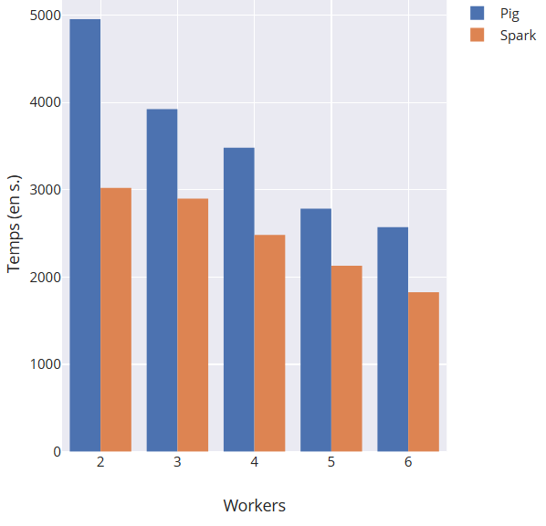

# X3IA020 - Analyse Comparative de l'Algorithme PageRank: Pig vs. PySpark
### Faculté des Sciences et Techniques - Nantes Université

Large Scale Data Management<br>
**Professeur** : MOLLI Pascal<br>

Comparaison de l'implémentation de l'algorithme PageRank entre Pig et PySpark.

- [1. Présentation de l'Expérience](#1-présentation-de-lexpérience)
- [2. Mise en œuvre et Analyse des Résultats](#2-mise-en-œuvre-et-résultats)
- [3. Conclusion](#3-conclusion) 
- [4. Guide d'Utilisation](#4-guide-d'utilisation)

# 1. Présentation de l'Expérience

L'objectif de cette étude est d'évaluer et de comparer les performances de deux implémentations de l'algorithme [**PageRank**](https://fr.wikipedia.org/wiki/PageRank):

- En utilisant [*Pig*](https://pig.apache.org/)
- En utilisant [*PySpark*](https://spark.apache.org/docs/latest/api/python/).

Cette analyse est inspirée de l'étude des Resilient Distributed Datasets (RDD) présentée à [NDSI 2012](https://www.youtube.com/watch?v=dXG4yC8ICEI).

Nous décrivons d'abord la [configuration expérimentale](#11-configuration-expérimentale) utilisée, avant d'analyser les [temps d'exécution](#2-mise-en-œuvre-et-résultats) et de discuter les [performances obtenues](#3-analyse-des-performances). Enfin, nous tirons des [conclusions et perspectives](#4-conclusion-et-perspectives) de cette étude.

## 1.1 Configuration Expérimentale

Pour comparer les performances de *Pig* et *PySpark*, nous avons utilisé le service [Dataproc](https://cloud.google.com/dataproc?hl=fr) de Google Cloud.

Les configurations spécifiques incluent :
* **Paramètres PageRank** : 3 itérations avec un facteur de **0.85** pour chaque implémentation.
* **Nombre de workers** : Varie de 2 à 6 noeuds de calcul
* **Données d'entrée** : dataset [page_links_en.nt.bz2](http://downloads.dbpedia.org/3.5.1/en/page_links_en.nt.bz2), stocké dans **gs://public_lddm_data//page_links_en.nt.bz2**
* **Versions des logiciels** : Apache Pig version 0.18.0 et Spark 3.1.3

Nous avons maintenu une configuration constante tout au long de nos expériences pour assurer la comparabilité des résultats entre *Pig* et *PySpark*. Cette configuration incluait un nœud maître `n2-standard-8` et des nœuds de calcul `n1-standard-4`.

## 1.2 Adaptations et Optimisations

### a. *Pig* : Distinctification des Liens

Le script *Spark* s'assure de l'absence de liens dupliqués dans les données chargées. Pour ne pas le désavantager face à *Pig*, nous utilisons `DISTINCT` dans le traitement des données (`data_distinct = DISTINCT data;`) pour s'assurer que les liens sont uniques.

### b. *Pig*/*Spark* : Volatilisation des Ressources Isolées

Soit le graphe suivant, comprenant 4 ressources et liens entre ces ressources. Prenons $d = 1/2$. Un cycle existe entre $C$ et $D$, tandis que $A$ et $B$ n'ont pas d'autres liens entrants.


**Initialisation :** Toute ressource qui est l'origine d'un lien se voit attribuer un rang initial de 1.


**Itération 1 :** Chaque cible de lien(s) se voit attribuer une fraction du rang des ressources se liant à elle.


**Itération 2 :** Même chose.


Deux problèmes se présentent alors.

#### Problème 1 :

Après la première itération, le rang des ressources qui n'ont pas de liens entrants se volatilise.

**Solution :** Lorsque le rang d'une ressource $X$ est absent après au moins 1 itération, cela indique qu'elle n'a pas de liens entrants. Ainsi, nous pouvons considérer $\text{PR}(X) = 1 - d$, ce qui n'affecte pas le calcul de la ressource de rang maximum, puisque son rang sera supposément plus élevé.

#### Problème 2 :

Après la deuxième itération, les ressources qui n'ont pas de liens entrants ne propagent pas leur rang aux ressources auxquelles elles sont liées, faussant ainsi progressivement les résultats. Dans l'exemple précédent, $\text{PR}(B) = 3/4$, mais celui-ci s'est volatilisé de par l'absence du rang de $A$, et ainsi de l'échec de la jointure avec les liens.

**Solution :** Au lieu de faire une jointure interne, les scripts réalisent une jointure externe vers les liens, pour s'assurer que toutes les pages, y compris celles sans liens entrants (orphelines), sont prises en compte dans le calcul du rang :

- *Pig* : le script utilise une `JOIN ... BY url RIGHT`, attribue un rang de base de `(1 - $d)` dans le cas échéant, et assure la persistence des données via une condition complémentaire `SUM( outbound_pagerank.pagerank ) IS NULL`.
- *Spark* : le script utilise `leftOuterJoin` pour assembler les RDDs `links` (contenant des paires d'URLs et leurs voisins) et `ranks` (les rangs actuels des URLs).

### c. *Pig* : Immutabilité des Liens

Contrairement à *Spark*, *Pig* doit écrire ses résultats complets à chaque étape. Ainsi, après chacun des deux scripts d'initialisation des rangs (`INIT`) et d'itération de l'algorithme (`UPDATE`), le programme réécrit l'ensemble des données. Soient les données lues et écrites par chaque script :
```math
\begin{align*}
\text{INIT}\quad&::\quad\text{data}\quad\rightarrow\quad\text{rangs}_0, \text{liens}_0 \\
\text{UPDATE}\quad&::\quad\text{rangs}_i, \text{liens}_i\quad\rightarrow\quad\text{rangs}_{i+1}, \text{liens}_{i+1} \\
\end{align*}
```
Cependant, les liens des pages entre elles ne varient pas durant les différentes itérations, et n'ont ainsi pas besoin d'être réécrits sur le disque. Par conséquent, nous pouvons éviter cette réécriture en gérant deux groupes de fichiers distribués distincts :

- en donnant le rang de chaque ressource, réécrit à chaque itération,
- en donnant les liens de chaque ressource.

### d. *Pig* : Paramétrage des Scripts

*Pig* ne permet pas de passer directement des paramètres lors de l'exécution du script. Les placeholders sont donc remplacés par les valeurs souhaitées avant l'exécution du script, sans nécessiter de modification du code source. C'est l'astuce que nous avons trouvé pour gérer la configuration et rendre le script réutilisable pour différents jeux de données ou paramètres d'exécution.

### e. *Pig*/*Spark* : Extraction de la ressource de plus haut rang

Après la dernière itération, nous souhaitons extraire la ressource avec le meilleur rang. Pour cela, nous souhaitons profiter des tâches existantes pour implémenter une étape complémentaire réalisant cette sous-tâche :

- *Pig* : un troisième script (`GETMAX`) est exécuté après la dernière itération, lisant uniquement les rangs de la dernière itération.
- *Spark* : un traitement complémentaire (`maxRankURL`) est ajouté à la séquence d'opérations existante.

# 2. Mise en œuvre et Résultats

Nous avons mesuré les performances de traitement de deux systèmes de traitement de données parallèles, Apache Pig et Apache Spark, sur un cluster de tailles variables. Le tableau suivant résume les temps d'exécution (en secondes) pour des clusters composés de 2 à 6 workers. Les logs d'exécution sont disponibles dans `doc/pypig` et `doc/pyspark` ou via les liens dans le tableau:

| Workers | *Pig* (en s)                                                | *Spark* (en s)                                      |
|---------|-------------------------------------------------------------|-----------------------------------------------------|
| 2       | [4954](doc/pypig/2.log) (1&#8239;h 22&#8239;min 34&#8239;s) | [3021](doc/pyspark/2.log) (50&#8239;min 21&#8239;s) |
| 3       | [3923](doc/pypig/3.log) (1&#8239;h 05&#8239;min 23&#8239;s) | [2898](doc/pyspark/3.log) (48&#8239;min 18&#8239;s) |
| 4       | [3483](doc/pypig/4.log) (58&#8239;min 03&#8239;s)           | [2482](doc/pyspark/4.log) (41&#8239;min 22&#8239;s) |
| 5       | [2785](doc/pypig/5.log) (46&#8239;min 25&#8239;s)           | [2131](doc/pyspark/5.log) (35&#8239;min 31&#8239;s) |
| 6       | [2573](doc/pypig/6.log) (42&#8239;min 53&#8239;s)           | [1826](doc/pyspark/6.log) (30&#8239;min 26&#8239;s) |

Graphiquement :



### Interprétation des Données

1. **Diminution du Temps d'Exécution avec Augmentation des Workers** : Pour les deux systèmes, le temps d'exécution diminue à mesure que le nombre de workers augmente. Cela indique que les deux systèmes bénéficient d'une meilleure parallélisation et d'une répartition efficace des tâches avec plus de ressources (workers).

2. **Performances Supérieures de *Spark* sur *Pig*** : À nombre égal de workers, *Spark* affiche systématiquement un temps d'exécution inférieur par rapport à *Pig*. Cela peut être attribué à l'efficacité de la gestion de la mémoire et des calculs de *Spark*, qui est conçu pour optimiser les opérations en mémoire, réduisant ainsi le temps d'attente pour les opérations de lecture et d'écriture sur disque.

3. **Efficacité à Grande Échelle** : La réduction relative du temps d'exécution entre 2 et 6 workers est plus prononcée pour Spark que pour *Pig*. Alors que *Pig* montre une diminution d'environ 48% du temps d'exécution, *Spark* montre une réduction d'environ 40%. Cela suggère que *Spark* gère plus efficacement les ressources additionnelles, rendant *Spark* plus adapté pour les opérations à grande échelle ou dans des environnements où la performance de traitement en temps réel est critique.

Voici un résumé des pages les mieux classées selon les résultats obtenus par *Pig* et *Spark* :

| System | MaxRank URL                                 | Rank Score               |
|--------|---------------------------------------------|--------------------------|
| Pig    | <http://dbpedia.org/resource/Living_people> | 38154.023                |
| Spark  | <http://dbpedia.org/resource/Living_people> | 38154.02655176225        |

Ces résultats montrent que, pour les deux systèmes, la page "<http://dbpedia.org/resource/Living_people>" a obtenu le score de classement le plus élevé.

# 3. Conclusion

Les résultats indiquent clairement l'efficacité de Spark par rapport à *Pig*, surtout dans des contextes nécessitant un traitement rapide des données avec des ressources informatiques limitées. L'avantage de performance de Spark se marque surtout avec l'augmentation des ressources, ce qui le rend particulièrement adapté pour les applications nécessitant une évolutivité élevée. Ces observations soutiennent la tendance générale observée dans l'industrie, où *Spark* est de plus en plus privilégié pour les traitements de données complexes et à grande échelle.

# 4. Guide d'Utilisation

Les scripts `setup.sh` et `run.sh` sont conçus pour faciliter la configuration et l'exécution de tâches sur un cluster. Voici comment les utiliser :

#### 1. Configuration du Cluster avec `setup.sh`

Ce script configure un cluster en spécifiant les détails comme le nom du bucket, le nom du cluster, le type de machines, etc.

**Usage :**

```bash
./setup.sh -b <bucket-name> -c <cluster-name> -p <project-name> [Options...]
```

**Options :**

- `-b <bucket-name>` : Nom du bucket Google Cloud Storage.
- `-c <cluster-name>` : Nom du cluster à créer.
- `-p <project-name>` : Nom du projet Google Cloud.
- `-r <region>` : Région du cluster (optionnel).
- `-z <zone>` : Zone du cluster (optionnel).
- `--master-type <master-machine-type>` : Type de machine pour le master (optionnel).
- `--worker-type <worker-machine-type>` : Type de machine pour les workers (optionnel).
- `--disk-size <disk-size>` : Taille du disque de démarrage pour les machines (optionnel).
- `--image-version <image-version>` : Version de l'image du cluster (optionnel).
- `--num-workers <number-of-workers>` : Nombre de workers dans le cluster (optionnel).

#### 2. Exécution des Tâches avec `run.sh`

Ce script permet de lancer des tâches *Pig* ou *Spark* sur le cluster configuré.

**Usage :**

```bash
./run.sh -b <bucket-name> -c <cluster-name> -p <project-name> [Options...]
```

**Options :**

- `-b <bucket-name>` : Nom du bucket Google Cloud Storage.
- `-c <cluster-name>` : Nom du cluster utilisé.
- `-p <project-name>` : Nom du projet Google Cloud.
- `-r <region>` : Région où le cluster est situé (optionnel).
- `-z <zone>` : Zone où le cluster est situé (optionnel).
- `-d <data-url>` : URL des données à traiter (optionnel).
- `-i <iter-count>` : Nombre d'itérations pour l'algorithme de PageRank (optionnel).

**Exemple d'Exécution :**

Pour lancer une tâche *Pig* :
```bash
./run.sh -b mon-bucket -c mon-cluster -p mon-projet --job pig
```

Pour lancer une tâche *Spark* :
```bash
./run.sh -b mon-bucket -c mon-cluster -p mon-projet --job spark
```
